# Pemograman_Mobile
<b>1. MyFirstExercise</b> 
 
<b>2. MyIntentApp</b> 
 
 
 
 
 
 
<b>3. MyViewAndViews</b> 
 
 
<b>4. FormDonasi</b> 
 
 
<b>15. FlexsibleFragment</b> 
 
 
 
<b>6. MyActionBar</b> 
 
 
 
<b>7. SignUpApk</b> 
 
 
<b>8. MyRecyclerView</b> 
 
 
<b>9. MyCardReciclerView</b> 
 
<b>UTS PEMOGRAMAN BERGERAK</b> 
 
 
 
<b>MY LOCALIZATION</b> 
 
 
 
<b>MYBACKGROUNDTHREAD</b> 
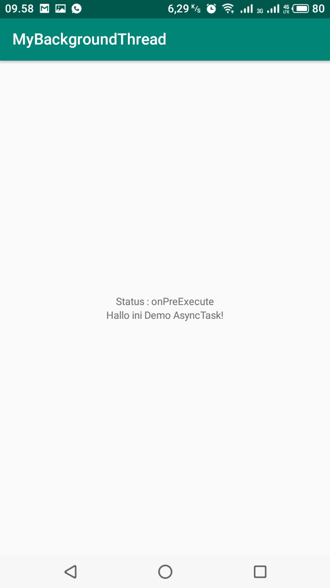 
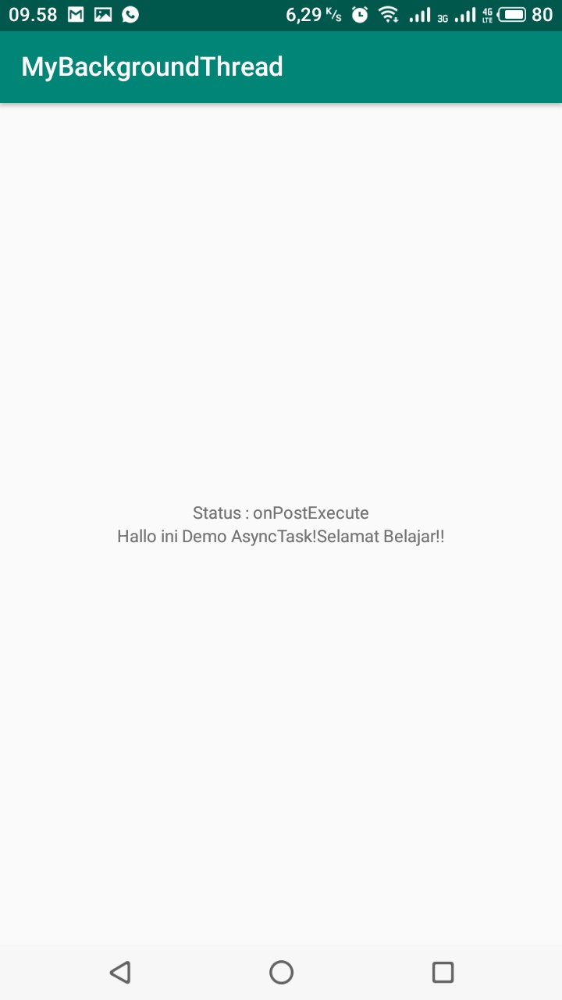 
<b>MYLOADER</b> 
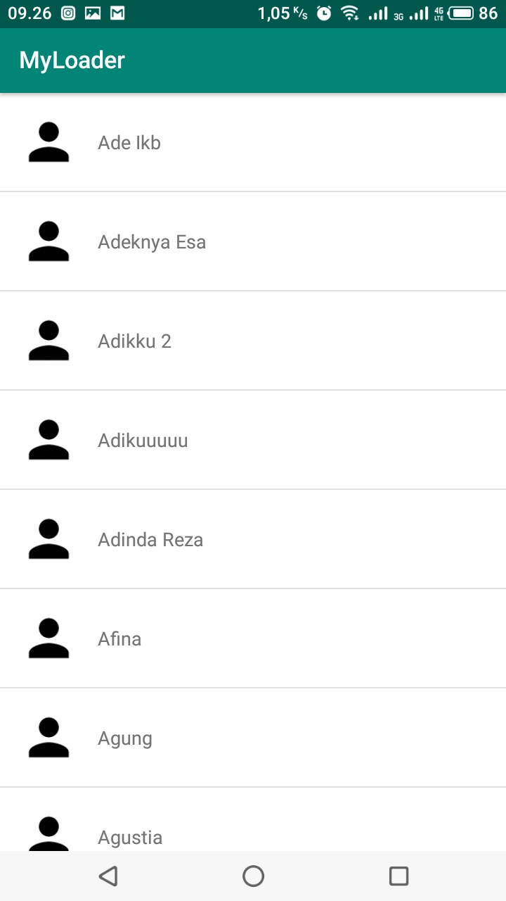 
 
<b>MYVIEWHOLDER</b> 
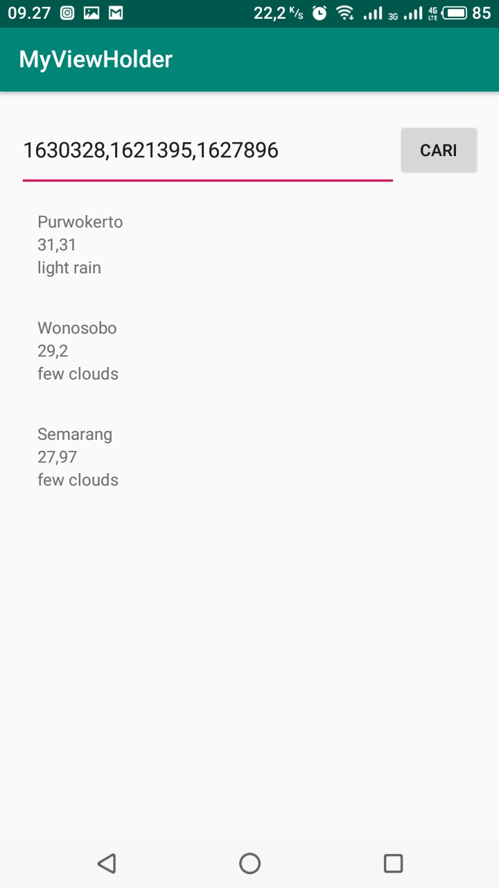 
<b>MYCLASS</b> 
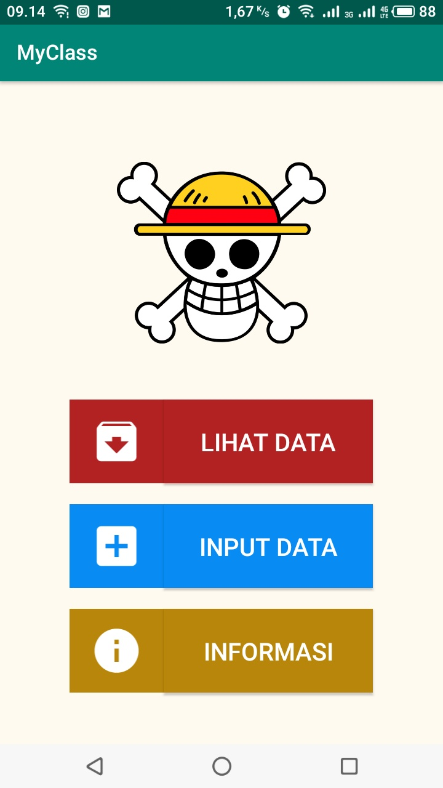 
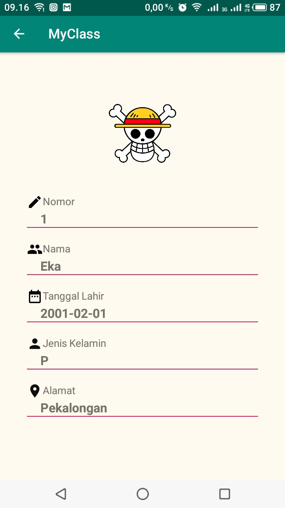 
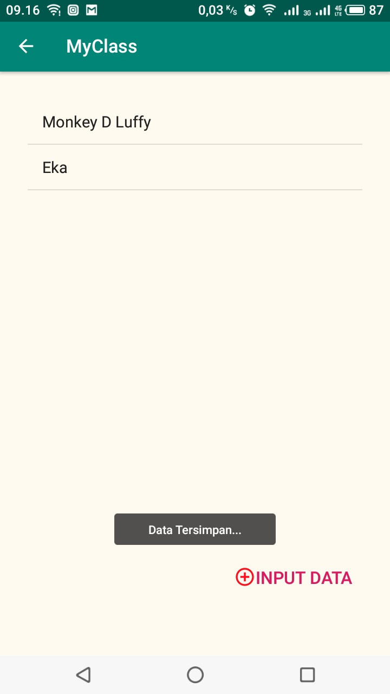 
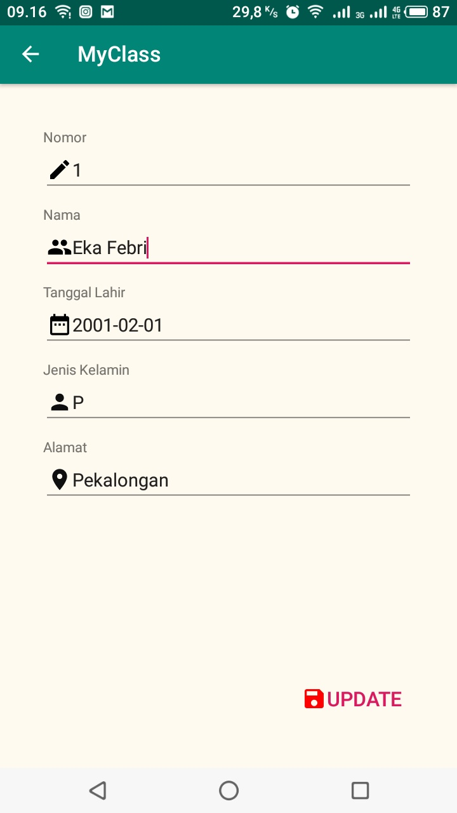 
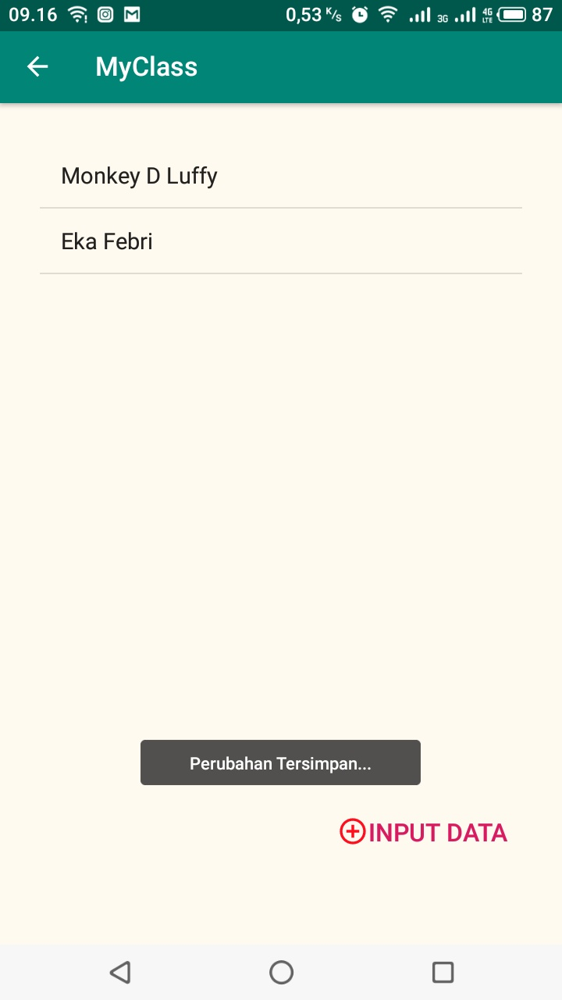 
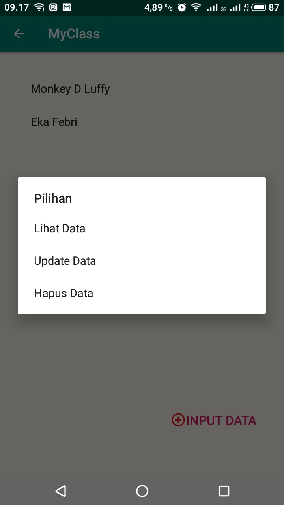 
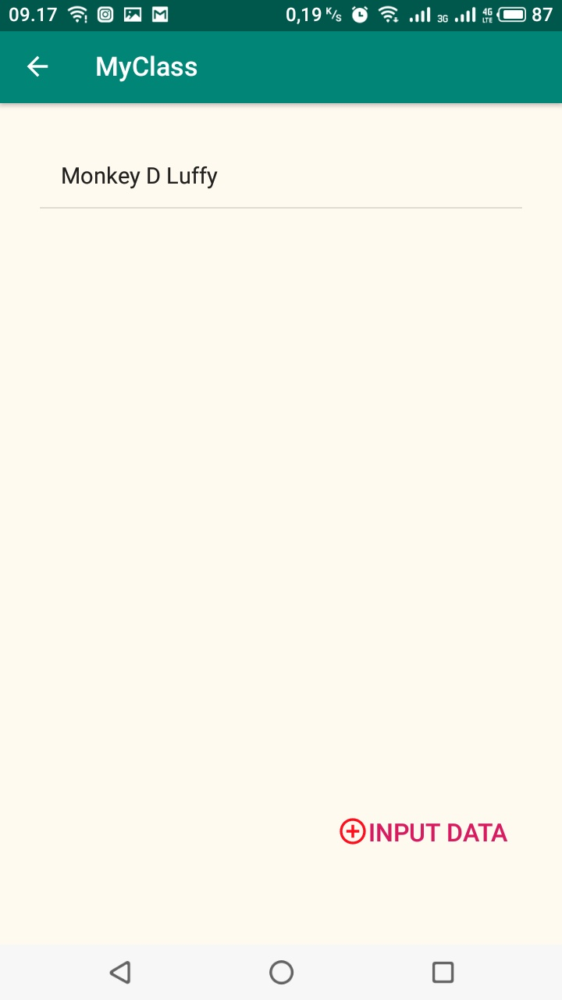 
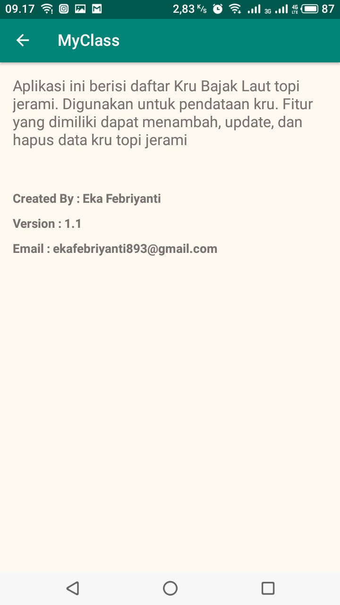 
<b>DAFTARBELANjA</b> 
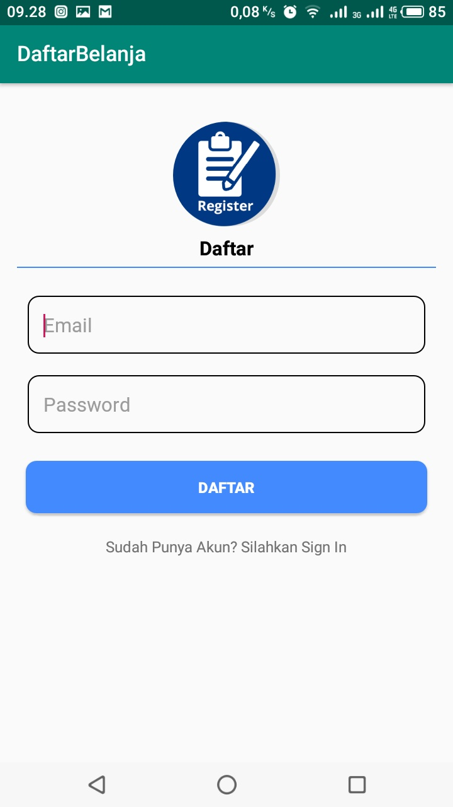 
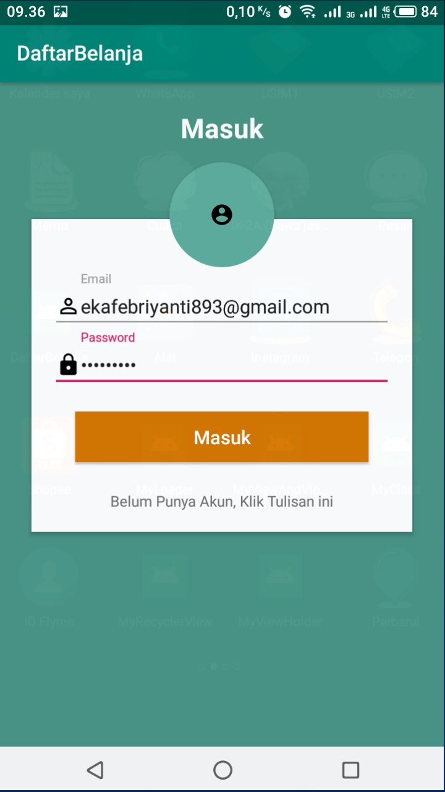 
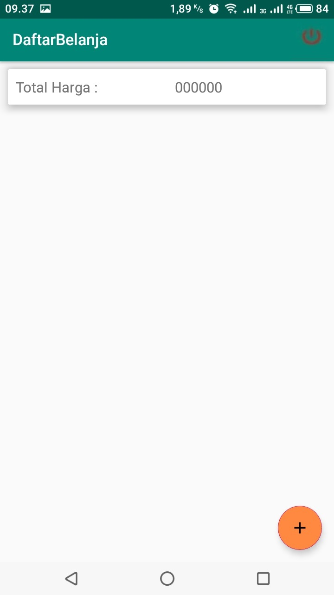 
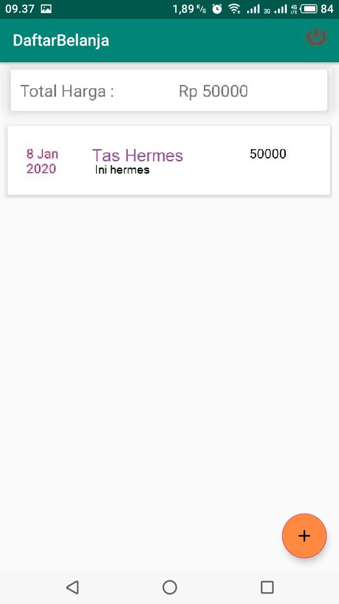 
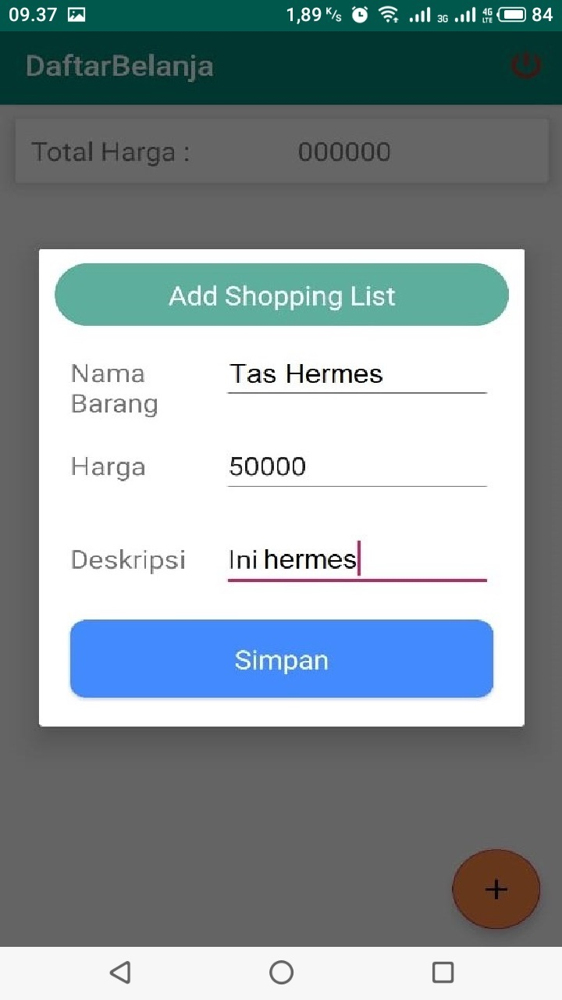 
